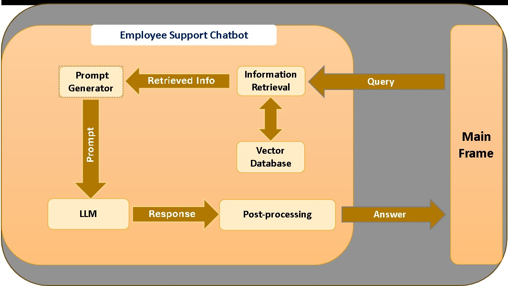

# Employee-Support-Chatbot using RAG

## Overview
This project is a Retrieval-Augmented Generation (RAG)-based chatbot created to handle employee support queries. The primary goal is to reduce the workload on management team by automating response to common employee queries.

## Data
A publicly available Employee Handbook was used to generate embeddings and create a local vector database for retrieval during chatbot interactions.

## Methodology
### System Pipeline

### Vector Store Creation
The vector store was built using a publicly available Employee Handbook as the source document. Text chunks were embedded using **the BAAI/bge-small-en-v1.5** sentence embedding model. These embeddings were then stored and loaded using FAISS (Facebook AI Similarity Search).

### Retriever Configuration
The retriever is configured to use MMR (Maximal Marginal Relevance) for more diversity in the retrieved documents. This helps reduce redundancy and improves the overall quality of context passed to the LLM. Parameters used in MMR:

- fetch_k = 10: number of top candidates fetched from the vector store based on similarity.
- k = 3: number of final documents selected after applying MMR re-ranking.

### Prompt Generation
A prompt template was defined to insert the retrieved context and user query into a structured format. This full prompt is then passed to the LLM for response generation. The goal is to provide relevant background information to the LLM to generate accurate response.

### Large Language Model
Due to hardware constraints, various medium-sized LLMs were tested for response quality and performance. Among all of them, "openchat/openchat-3.5-0106" performed the most accurate responses.